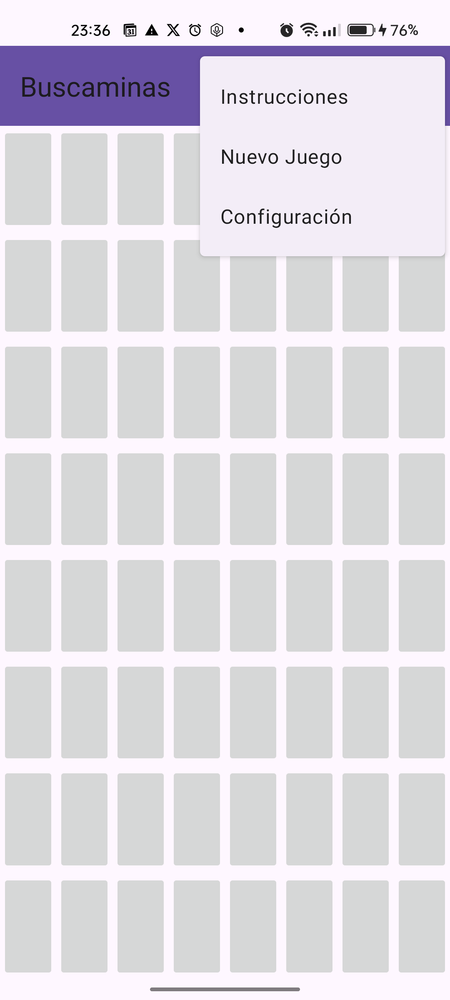
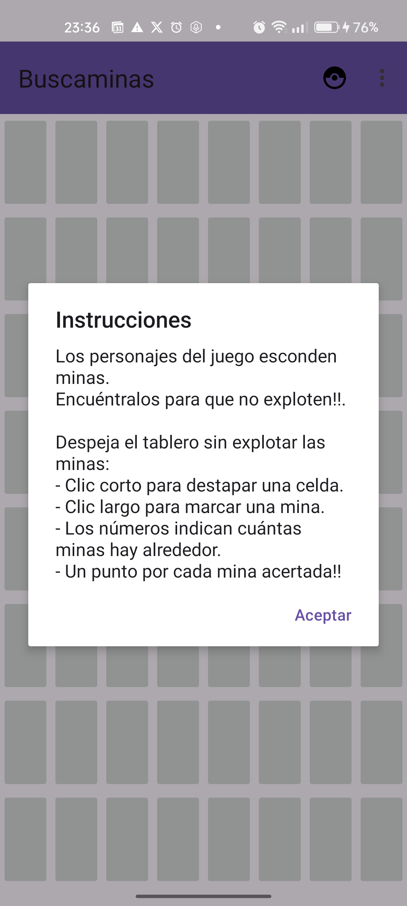
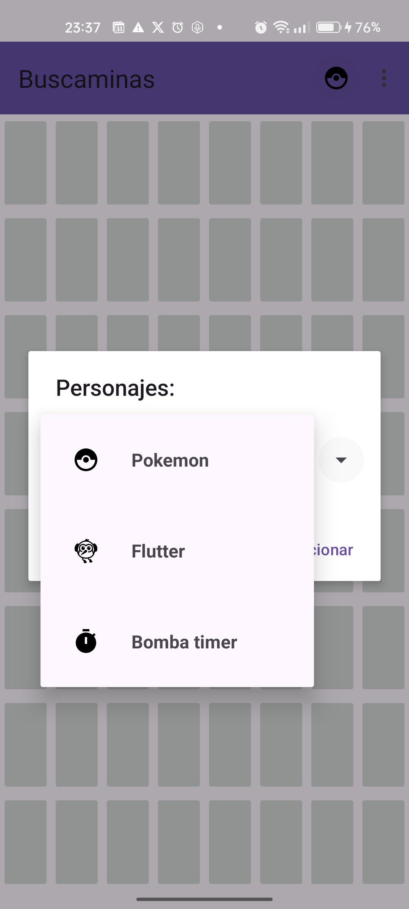
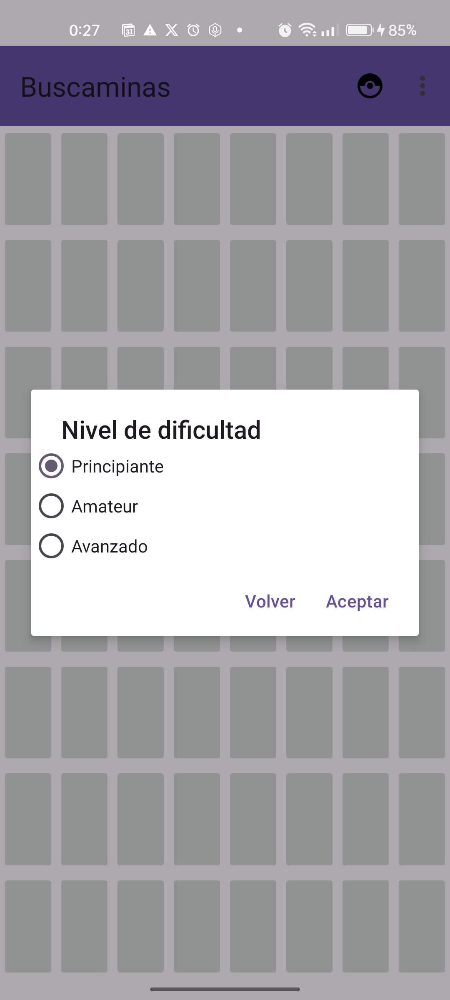
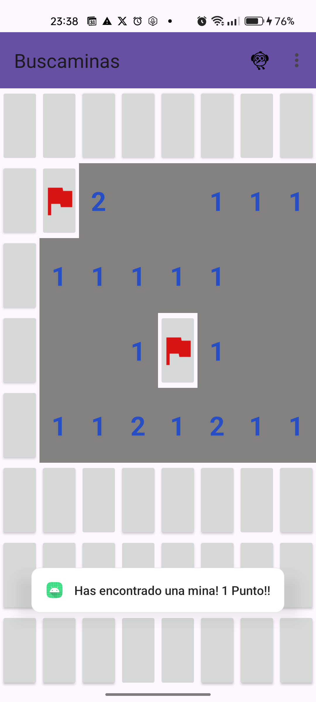
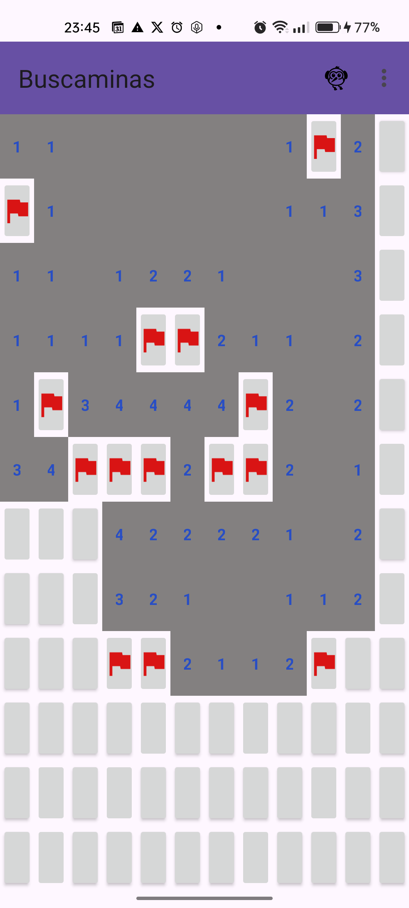
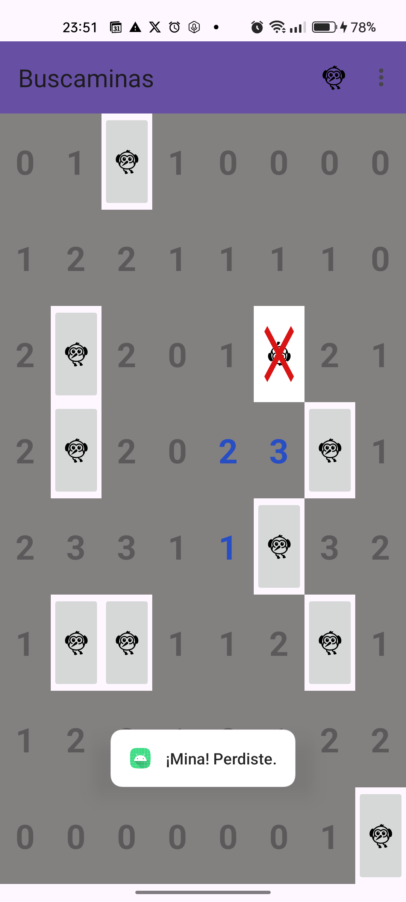
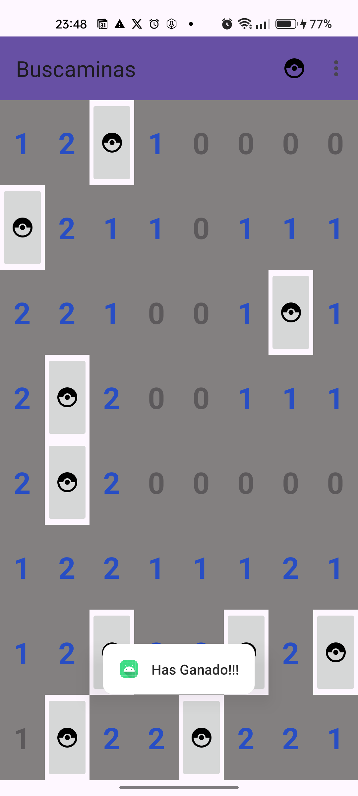

# 💣 Buscaminas
*Buscaminas versionado con personajes que esconden minas*

---

## Descripción

Versión del clásico Buscaminas desarrollada en **Android (Java)**, con la particularidad de que las minas están representadas por personajes divertidos que esconden minas. Encuentra a los personajes antes de que exploten!

- **Clic corto**: destapa la celda.  
- **Clic largo**: marca la mina.  
- Números indican cuántas minas hay alrededor.  
- Puedes elegir los personajes que representan las minas.

---

## Características destacadas

- **Tablero dinámico** según nivel de dificultad: principiante, intermedio y avanzado.  
- **Diferenciación de clics:** corto para destapar, largo para marcar.  
- **Selección de personajes** mediante Spinner personalizado.  
- **Menú completo**: instrucciones, configuración y selección de personaje.  
- **Interfaz intuitiva** adaptable a distintos tamaños de pantalla.  
- Sistema de puntuación y mensajes dinámicos de victoria/derrota.  

---

## Tecnologías utilizadas

- **Lenguaje:** Java  
- **Framework:** Android SDK  
- **Layouts:** ConstraintLayout, GridLayout  
- **Componentes:** Button, ImageButton, Spinner, AlertDialog, Toolbar  
- **Gestión de eventos:** OnClickListener, OnLongClickListener  
- **Patrones:** Adaptadores y gestión de eventos en la lógica del juego  

---

## 📂 Estructura del proyecto
  
- `MainActivity.java`: Actividad principal y lógica del tablero.
- `logica/adaptador.java`: Adaptador para el Spinner de personajes.
- `modelo/`
     - `Casilla.java`
     - `Partida.java`
     - `Tablero.java`
     - `Personaje.java`
- `res/` : Recursos XML y gráficos
    - `drawable/`: Iconos e imágenes
    - `layout/`
        - `activity_main.xml`: interfaz gráfica principal.
        - `item_personajes.xml`: fila del menú personajes.
    - `menu/menu_main.xml`: interfaz del menú de opciones.
    - `values/strings.xml`: textos de la app.

---

## ⚙️ Instalación / Requisitos

- Android Studio  
- SDK mínimo: Android 7.0 Nougat (API 24)  
- Clonar el repositorio y abrir en Android Studio  
- Sincronizar Gradle  
- Ejecutar en emulador o dispositivo físico  

---

## 🚀 Cómo jugar

1. Selecciona un **nivel de dificultad** desde el menú.  
2. Elige tu **personaje favorito**.  
3. Pulsa **Nuevo Juego** en el menú.  
4. Aparecerá un tablero con casillas.  
5. Pulsa en las casillas:
   - **Clic corto** → destapar celda.  
   - **Clic largo** → marcar mina con bandera.  
6. Evita las minas y encuentra todas para ganar.  
7. Acumula puntos al identificar correctamente las minas.  

---

## Futuras mejoras

- Indicador de puntuación en tiempo real en la barra superior.
- Pantalla de inicio más intuitiva y atractiva.
- Soporte de rotación de pantalla y adaptabilidad.
- Sistema de records persistente.
- Icono de la app personalizado.
- Internacionalización.
- Sonidos y animaciones al acertar/fallar.  

---

## Notas y Créditos

La mecánica del juego es una variación del clásico Buscaminas de Microsoft. 
Iconos y recursos gráficos: Material Design Icons (solo con fines demostrativos). 
Implementación original, desarrollada por Vanesa Hernández Juarros.

## Capturas

---

## Autor

Proyecto creado por **Vanesa Hernández Juarros**

---
